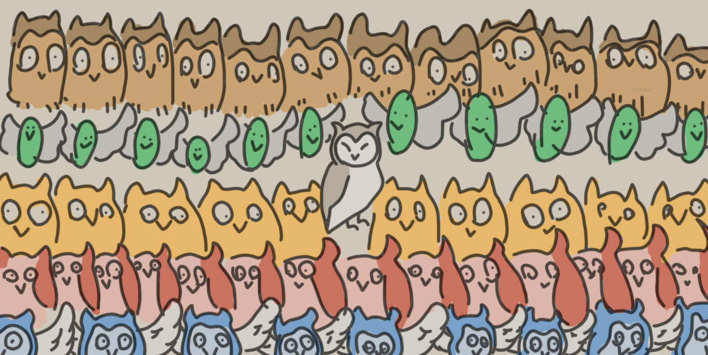

# Trabalho 2: Desbravando Prolog!

Neste trabalho, vocês trabalharão em duplas para aprofundar o que conhecem sobre Prolog. 

Cada dupla vai trabalhar em um tema, produzir material sobre ele e depois apresentá-lo brevemente para a turma.

---
## Tema 1: Listas e recursão em Prolog
Dupla: [Luís Henrique e João Davi](https://github.com/elc117/t2-2022a-luis_chesani_joao_davi)

  
Clique para ver detalhes!

  
  ### Motivação
  Vocês lembram que Prolog suporta listas nativamente, né? Listas são delimitadas por colchetes, assim como em Haskell, mas as listas em Prolog podem ser heterogêneas. 
  
  Listas são muito usadas em Prolog e existem muitos predicados pré-definidos que manipulam listas. Já vimos alguns nas práticas (por exemplo `length` e `sum_list`), mas existem muitos outros. 
  
  Internamente, muitos predicados com listas são implementados com **recursão**. Em Prolog, a lógica da recursão com listas é semelhante ao que se faz com Haskell, em que separamos a lista em Head e Tail. 

  

  ### Desenvolvimento
  Neste tema, vocês vão descobrir mais sobre a implementação recursiva de predicados pré-definidos que manipulam listas em Prolog. Além disso, vocês vão pesquisar/construir exemplos de uso destes predicados.

  Etapas do trabalho:
  1. Ver [slides](https://docs.google.com/presentation/d/1GwioxL7tPM4S5vdg5Mw6XzC2jRaGsWYWary00-1A9Nk/edit#slide=id.g35ed75ccf_0134) resumidos sobre listas em Prolog.
  2. Testar exemplos dos slides.
  3. Ver a biblioteca de [predicados com listas](https://www.swi-prolog.org/pldoc/man?section=lists) do SWI-Prolog.
  4. Pesquisar como são implementados alguns dos predicados com listas (no mínimo 2 para cada estudante, mas quanto mais, melhor).
  5. Pesquisar/construir exemplos de uso dos predicados com listas (não necessariamente os da etapa anterior). Para os exemplos ficarem mais completos, vocês devem criar uma base de fatos e regras inspiradas em algum problema/contexto.
  6. Produzir material para apresentar o tema à turma, incluindo algum exercício proposto (roteiro de prática, quiz, etc.).

  
  ### Material de apoio

  - [Biblioteca de predicados com listas do SWI-Prolog](https://www.swi-prolog.org/pldoc/man?section=lists)

---
## Tema 2: Recursão, condicionais e I/O em Prolog

  
Clique para ver detalhes!

  
  ### Motivação

  Vocês lembram que Prolog é uma linguagem declarativa, né? Ao contrário de linguagens imperativas, Prolog não tem estruturas de repetição como laços `for` ou `while` em C. Repetições são expressas com predicados recursivos, que devem ter algum caso/condição de parada. Talvez vocês não tenham notado, mas desde a primeira prática o código fornecido já tinha um caso de recursão.

  Como qualquer linguagem, Prolog também dispõe de instruções de I/O, por exemplo os predicados `write`, `print`, `read`, entre outros. Ao contrário do que acontece em Haskell, em Prolog é simples combinar I/O com outros predicados, incluindo recursão e condicionais.

  ### Desenvolvimento

  Neste tema, vocês vão descobrir mais sobre recursão, condicionais e I/O em Prolog.  
  Além disso, vocês vão pesquisar/construir exemplos que empreguem estes recursos da linguagem.

  Etapas do trabalho:
  1. Consultar os links selecionados no material de apoio para saber mais sobre o tema.
  2. Testar exemplos contidos do material consultado.
  3. Pesquisar outros exemplos relacionados ao tema, incluindo outras formas de escrever condicionais e outras opções de I/O em Prolog (por exemplo, I/O com arquivos).
  4. Elaborar um ou mais exemplos contendo recursão, condicionais e I/O. Podem ser pequenos exemplos simples (poucas linhas de código) ou um exemplo mais longo, inspirado em algum problema/contexto. Uma sugestão é incluir leitura/escrita de dados em arquivo.
  5. Produzir material para apresentar o tema à turma, incluindo algum exercício proposto (roteiro de prática, quiz, etc.).

  ### Material de apoio

  - Capítulo [Recursive Rules](https://en.wikibooks.org/wiki/Prolog/Recursive_Rules) no [livro sobre Prolog em Wikibooks](https://en.wikibooks.org/wiki/Prolog)

  - Capítulo [Recursive Definitions](http://www.let.rug.nl/bos/lpn//lpnpage.php?pagetype=html&pageid=lpn-htmlse9) em [Learn Prolog Now](http://www.learnprolognow.org/) 

  - Capítulo [Loop & Decision Making](https://www.tutorialspoint.com/prolog/prolog_loop_and_decision_making.htm) do [tutorial Prolog em tutorialspoint](https://www.tutorialspoint.com/prolog/index.htm) (este tutorial usa GNU Prolog, mas os exemplos se aplicam ao SWI-Prolog também)

---
## Tema 3: Processo de execução de programas Prolog

  
Clique para ver detalhes!

  
  ### Motivação
  A execução de um programa Prolog funciona como uma busca em profundidade em uma árvore de fatos e regras. Durante o processo de execução, ocorrem internamente operações de unificação (matching) e retrocesso (backtracking). Podemos controlar parte desse processo com um corte (cut, expresso por `!`).

  Saber mais sobre o processo de execução ajuda a entender melhor o resultado das consultas. Além disso, pode ajudar a escrever programas Prolog mais eficientes.

  ### Desenvolvimento
  
  Neste tema, vocês vão descobrir mais sobre unificação (matching), retrocesso (backtracking) e corte (cut) em Prolog.
  Além disso, vocês vão pesquisar/construir exemplos que demonstrem este processo.

  Etapas do trabalho:
  1. Ver [roteiro de prática](https://github.com/AndreaInfUFSM/elc117-2021a/tree/master/praticas/prolog/prolog05) sobre o processo de execução de programas Prolog. Lá vocês encontrarão um link para slides sobre o assunto, que vocês deverão consultar antes da prática.
  2. Pesquisar outros exemplos e explicações relacionados ao tema, sempre guardando um registro das referências consultadas. 
  3. Elaborar/testar exemplos para ilustrar unificação, retrocesso e corte em diferentes situações. Por exemplo, é importante examinar versões de um predicado com e sem corte.
  4. Produzir material para apresentar o tema à turma, incluindo algum exercício proposto (roteiro de prática, quiz, etc.).

  
  
  ### Material de apoio

  - Capítulo [Cuts and Negation](http://www.let.rug.nl/bos/lpn//lpnpage.php?pagetype=html&pageid=lpn-htmlch10) em [Learn Prolog Now](http://www.let.rug.nl/bos/lpn//lpnpage.php?pageid=online)

  - Johan Bos. [Drawing Prolog Search Trees: A Manual for Teachers and Students of Logic Programming](https://arxiv.org/abs/2001.08133)

---
## Tema 4: Árvores genealógicas em Prolog

  
Clique para ver detalhes!

  
  ### Motivação

  Um exemplo clássico em Prolog é o de árvores genealógicas (family trees): dada uma base com informações (fatos) sobre pessoas e seus ascendentes e/ou descendentes, são formuladas regras que permitem deduzir relações de parentesco.

  Variações deste exemplo clássico se encontram em muitas referências introdutórias sobre Prolog e até em exames/provas (veja, por exemplo, [provas do ENADE 2021](https://www.gov.br/inep/pt-br/areas-de-atuacao/avaliacao-e-exames-educacionais/enade/provas-e-gabaritos)). Conhecer este exemplo a fundo ajuda a entender o papel de variáveis e condições na formulação de regras.

  ### Desenvolvimento

  Neste tema, vocês vão descobrir mais sobre a representação de árvores genealógicas em Prolog.  Além disso, vocês vão construir um exemplo customizado que permita consultar diversas relações de parentesco.

  Etapas do trabalho:
  1. Consultar os links selecionados no material de apoio para saber mais sobre o tema.
  2. Testar exemplos contidos no material consultado.
  3. Pesquisar e testar outros exemplos relacionados ao tema.
  4. Elaborar um exemplo customizado, que tenha muitos dados e muitas regras de parentesco, para permitir consultas variadas.
  Vocês podem alimentar o exemplo com dados históricos reais (monarquias, por exemplo) ou fictícios gerados por vocês (possivelmente usando Prolog!).
  5. Produzir material para apresentar o tema à turma, incluindo algum exercício proposto (roteiro de prática, consulta, quiz, etc.).

  
  ### Material de apoio

  - [Geneology Database](https://kti.mff.cuni.cz/~bartak/prolog/genealogy.html): capítulo de um livro online
  - [Prolog Family Tree](https://www.educba.com/prolog-family-tree/)
  - [Prolog - Family Tree](https://www.101computing.net/prolog-family-tree/)
  - [How to learn Prolog by watching Game of Thrones](https://medium.com/free-code-camp/how-to-learn-prolog-by-watching-game-of-thrones-4852ea960017)
  - [Family Relations](https://swish.swi-prolog.org/p/ltc_family.swinb): notebook no SWISH

---
## Tema 5: Problemas de lógica em Prolog

  
Clique para ver detalhes!

  
  ### Motivação

  Problemas de lógica são comuns em materiais de estudo, desafios ou passatempos. Resolver este tipo de problema é uma forma de desenvolver o raciocínio lógico, uma importante habilidade humana. Também é possível desenvolver programas que resolvam esse tipo de problema, aparentando alguma "inteligência". Prolog é uma boa linguagem para isso.

  Na segunda prática de Prolog, foi apresentada uma solução para um problema de lógica popular. Também foi apresentado um problema a ser resolvido por vocês. Um passo importante para resolver esse tipo de problema é conectar todas as condições a serem satisfeitas, representando-as sob forma de uma ou mais regras.

  ### Desenvolvimento
  
  Neste tema, vocês vão explorar mais sobre o uso de Prolog em problemas de lógica, conhecendo mais exemplos resolvidos e buscando novos problemas para resolver.

  Etapas do trabalho:
  1. Consultar os links selecionados no material de apoio para saber mais sobre o tema.
  2. Testar exemplos contidos no material consultado.
  3. Pesquisar e testar outros exemplos relacionados ao tema.
  4. Buscar novos problemas e resolvê-los (pelo menos um para cada integrante da dupla). Algumas fontes de problemas são o site [Rachacuca](https://rachacuca.com.br/logica/problemas/) ou as [provas de Iniciação](https://olimpiada.ic.unicamp.br/passadas/) da Olimpíada Brasileira de Informática (OBI).
  5. Produzir material para apresentar o tema à turma, incluindo algum exercício proposto (roteiro de prática, consulta, quiz, etc.).
  
  ### Material de apoio
  - Capítulo [Prolog/Solving a Logic Puzzle](https://en.wikibooks.org/wiki/Prolog/Solving_a_Logic_Puzzle) no [livro sobre Prolog em Wikibooks](https://en.wikibooks.org/wiki/Prolog)
  - [Puzzles in Prolog](https://ypologist.com/mmalita17/HOMEPAGE/logic/index.html)
  - [Using Prolog to Solve Logic Puzzles](http://bennycheung.github.io/using-prolog-to-solve-logic-puzzles)

---
## Tema 6: Aplicações Web em Prolog

  
Clique para ver detalhes!

  
  ### Motivação

  Prolog não é uma linguagem popular em aplicações (clientes ou servidores) Web, mas com ajuda de algumas bibliotecas isso pode se tornar surpreendentemente simples. 
  
  Páginas Web são basicamente árvores de símbolos que podem ser facilmente gerados ou processados em Prolog. 

  ### Desenvolvimento

  Neste tema, vocês vão descobrir bibliotecas do Prolog que se prestam ao desenvolvimento de aplicações Web (clientes e/ou servidores), além de desenvolver exemplos customizados conforme o interesse de vocês.

  Etapas do trabalho:
  1. Consultar os links selecionados no material de apoio para saber mais sobre o tema.
  2. Testar exemplos contidos no material consultado.
  3. Pesquisar e testar outros exemplos relacionados ao tema, descobrindo as bibliotecas que são úteis em cada situação.
  4. Elaborar um exemplo customizado de um cliente e de um servidor Web. O cliente pode fazer uma requisição a um serviço existente que retorne dados em formato JSON ou HTML. O servidor pode retornar apenas texto, sem preocupação com estilo/formatação.
  5. Produzir material para apresentar o tema à turma, incluindo algum exercício proposto (roteiro de prática, consulta, quiz, etc.).

  
  ### Material de apoio

  - [SWI-Prolog HTTP support](https://www.swi-prolog.org/pldoc/doc_for?object=section(%27packages/http.html%27))
  - [Prolog Web Applications](https://www.metalevel.at/prolog/web)

---
## Tema 7: Outras aplicações de Prolog

  
Clique para ver detalhes!

  
  ### Motivação

  Prolog pode ser usado em muitas aplicações interessantes, geralmente relacionadas ao processamento de símbolos e em áreas ligadas à Inteligência Artificial. 

  Desenvolver alguma aplicação "do zero" pode ser complicado para quem só tem algumas poucas horas de prática com a linguagem, mas com um conhecimento básico de Prolog é possível entender, testar e adaptar exemplos de aplicações cujo código esteja disponível.

  ### Desenvolvimento

  Neste tema, vocês vão explorar exemplos de aplicações em Prolog que tenham o código disponível para estudo, testes e adaptação.

  Etapas do trabalho:
  1. Consultar os links no material de apoio para conhecer alguns exemplos de aplicações de Prolog.
  2. Testar exemplos contidos no material consultado.
  3. Pesquisar outras aplicações que tenham código disponível.
  4. Escolher pelo menos 2 códigos (um para cada integrante da dupla) para estudo mais aprofundado. Podem ser 2 códigos que resolvam o mesmo problema.
  5. Analisar o código, identificando elementos conhecidos ou não, e procurando possibilidades de modificação, mesmo que pequenas (adição/reescrita de fatos/regras, formas alternativas de I/O, etc.)
  5. Produzir material para apresentar o tema à turma, incluindo algum exercício proposto (roteiro de prática, consulta, quiz, etc.).
  
  ### Material de apoio

  - [P-99: Ninety-Nine Prolog Problems](https://www.ic.unicamp.br/~meidanis/courses/mc336/problemas-prolog/)
  - [Collection of misc Prolog programs](https://github.com/charlesjlee/prolog)
  - [Eliza Chatbot in Prolog](https://swish.swi-prolog.org/example/eliza.pl)
  - [Sudoku solver in Prolog](https://www.swi-prolog.org/pldoc/man?section=clpfd-sudoku) (incluir `:- use_module(library(clpfd)).` no início do programa).

---

## Entrega

  O repositório de entrega da dupla deve conter:
  - Códigos em Prolog (.pl): produzidos/adaptados 
  - README.md contendo:
    - Textos/imagens/códigos explicativos
    - Links para códigos no repositório e para outros materiais produzidos por vocês e hospedados externamente (slides, etc.)
    - Exercício proposto (enunciado de prática, quiz, etc.)
    - Referências consultadas (além do material de apoio)

  Clique aqui para criar o repositório de entrega: https://classroom.github.com/a/7GZ0dz_K

## Apresentação

  A dupla terá 5-10min para apresentar o tema à turma. 

## Material de apoio

Algumas referências úteis para todos os temas:

- Bruce A. Tate. [Seven Languages in Seven Weeks: A Pragmatic Guide to Learning Programming Languages](https://www.semanticscholar.org/paper/Seven-Languages-in-Seven-Weeks%3A-A-Pragmatic-Guide-Tate/8ab7286cc9e93b11bf783d4ba1d3ddc14630d202). Ver capítulo 4 - Prolog.

- Patrick Blackburn, Johan Bos, and Kristina Striegnitz. [Learn Prolog Now](http://www.learnprolognow.org/). 

- Markus Triska. [The Power of Prolog](https://www.metalevel.at/prolog).

- Bill Wilson. [The Prolog Dictionary](http://www.cse.unsw.edu.au/~billw/dictionaries/prolog/)
