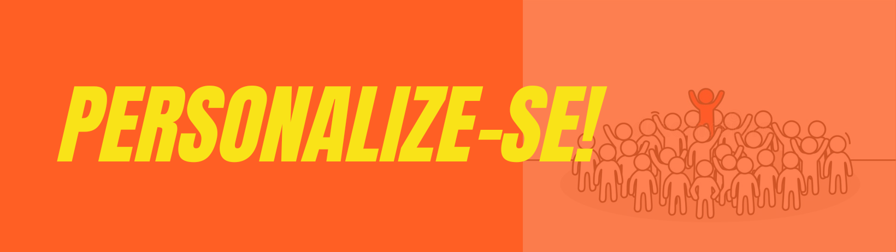

# Trabalho 3: Personalize-se!

## Motivação

Em poucas semanas, você experimentou 2 linguagens de programação muito diferentes do que já conhecia.
Você conheceu novos conceitos e recursos, resolveu problemas propostos, teve dúvidas, brigou com novas sintaxes, leu e escreveu código... Você talvez nem se dê conta, mas está com uma visão mais ampla do grande "oceano" das linguagens de programação, e nessa hora vale um ditado motivacional: "Mar calmo nunca fez bom marinheiro" :smiley:.  Neste trabalho, você já conquistou o direito de escolher um tema e vai desenvolver um trabalho personalizado, com a sua cara, se desafiando a ir um pouco além no "mar" das linguagens declarativas.

## Objetivo
Seu objetivo neste trabalho é uma produção à sua escolha, com alguma linguagem que suporte programação funcional ou lógica. 

## Requisitos

Para ajudar você em suas escolhas e para incentivar um trabalho de qualidade, temos alguns (poucos) requisitos:

- O trabalho deve envolver leitura e/ou escrita de código em alguma linguagem que suporte programação funcional ou lógica (pode ou não ser uma das linguagens que estudamos).

- O trabalho deve ter evidências de originalidade e do processo de desenvolvimento, com muitos comentários sobre o que motivou sua escolha, que materiais você buscou e o que aproveitou.

- Você pode trabalhar individualmente ou em dupla.

## Sugestões

Se você achou os requisitos muito amplos e está estranhando ter tanta liberdade, aqui vão alguns exemplos concretos que podem (ou não) servir de guia:

- Haskell/Prolog despertaram sua curiosidade? Algumas ideias para ir mais além nessas linguagens são: 
  1. Escrever/estudar um programa em Haskell/Prolog com alguma funcionalidade do seu interesse. Vale implementar algo "do zero", adaptar código de terceiros, reescrever em Haskell/Prolog algum código que você tenha produzido em outra linguagem, usar alguma biblioteca/framework para algum nicho de aplicação [em Haskell](https://wiki.haskell.org/Applications_and_libraries#Haskell_applications_and_libraries) ou [Prolog](https://www.swi-prolog.org/pldoc/man?section=libpl). Não vale simplesmente entregar algum código que você encontrar por aí :smiley:.
  2. Produzir um material explicativo sobre algum recurso de Haskell/Prolog que não tenha sido visto na disciplina, ou que você queira entender melhor. Vale escolher um tópico e resolver exercícios, produzir alguma ilustração, texto, vídeo sobre o tópico, etc. Não vale simplesmente reproduzir algum tutorial que você encontrar por aí, ou repetir algo que já foi feito sem acrescentar nada.

- Você não quer mais ouvir falar de Haskell/Prolog? Tudo bem, aqui vão algumas ideias:
  1. Estude como os paradigmas funcional/lógico estão presentes em alguma linguagem à sua escolha. Teste exemplos, siga tutoriais ou faça exercícios, lembrando de comentar o que você encontrou de semelhança/diferença com o que foi visto na disciplina. 
  2. Escreva/estude um programa em uma linguagem à sua escolha, aplicando recursos dos paradigmas funcional/lógico. Você pode associar mais de um paradigma, só não desvie do foco na programação declarativa (funcional/lógica).
  
- Ainda não se achou? Converse com a professora!

## Entrega

- Até dia 15/06, você deve comunicar à professora o tema e o prazo escolhido (1, 2 ou mais semanas), de acordo com o grau de dificuldade estimado. 
- Trabalhos em dupla devem ter motivação e resultados compatíveis (evidências de que não foi só uma pessoa que trabalhou).
- Clique aqui para criar o repositório de entrega: https://classroom.github.com/a/QmfmXz0n
- O repositório de entrega será público e deverá conter pelo menos um `README.md` estruturado em seções, descrevendo suas motivações e os resultados do trabalho, que podem ficar hospedados no próprio GitHub em serviços externos (p.ex. Google Drive, YouTube, Medium, etc.).

