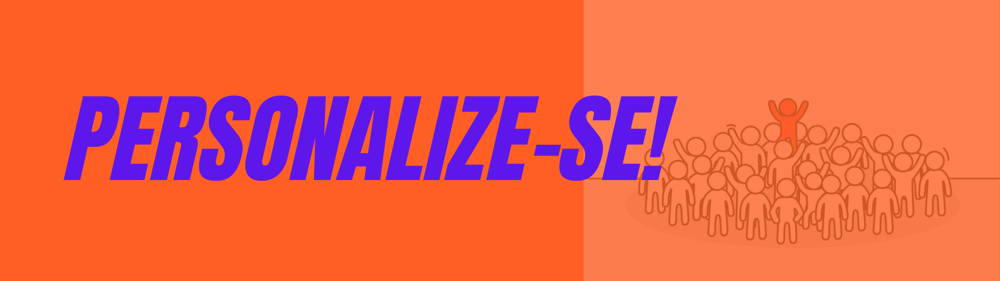

# Trabalho 5: Personalize-se (de novo)!

## Motivação

Você já percebeu que o mundo das linguagens de programação é muito diverso, né? Isso sem falar no que podemos criar com essas ferramentas cada vez mais poderosas! Diante de tanta diversidade, nada melhor do que exercitar sua autonomia mais uma vez, para terminar este semestre de descobertas!

## Objetivo
Seu objetivo neste trabalho é mais uma produção à sua escolha, com alguma linguagem que suporte programação orientada a objetos e/ou concorrente. 

## Requisitos

Para ajudar você em suas escolhas e para incentivar um trabalho de qualidade, temos alguns (poucos) requisitos:

- O trabalho deve envolver leitura e/ou escrita de código em alguma linguagem que suporte programação orientada a objetos e/ou concorrente (pode ser Java ou qualquer outra).

- O trabalho deve ter evidências de originalidade e do processo de desenvolvimento, com muitos comentários sobre o que motivou sua escolha, que materiais você buscou e o que aproveitou.

- Você pode trabalhar individualmente ou em dupla, mas trabalhos em dupla devem ter motivação e resultados compatíveis (evidências de que não foi só uma pessoa que trabalhou).

- É preciso validar o tema do trabalho com a professora antes de começar.

## Sugestões

Algumas possibilidades que podem (ou não) servir de guia na busca de um tema para este trabalho:

1. Estude o código de grandes projetos open-source: Java e o paradigma orientado a objetos estão presentes em muito software de grande escala e de código aberto. Mesmo que você não tenha como objetivo contribuir para um projeto desses, é um ótimo exercício examinar o código de projetos desenvolvidos por várias pessoas e ver os recursos das linguagens em ação. Baixe o código, faça build, examine o código em diferentes níveis de detalhe (pacotes, classes, ...), identifique conceitos/recursos que você conhece e descubra novidades. Alguns exemplos de projetos: [Robocode](https://github.com/robo-code) (um jogo de programação: Build the best - destroy the rest!), [Arduino](https://github.com/arduino/Arduino) (siiim, a plataforma Arduino é feita em Java/Python), [Mindustry](https://github.com/Anuken/Mindustry) (um jogo feito em Java/libGDX), [Spring Boot](https://github.com/spring-projects/spring-boot) (famoso framework em Java para aplicações Web), etc.

2. Descubra como outras linguagens lidam com concorrência! Threads são uma das muitas abstrações que podemos usar para lidar com concorrência, e você encontra threads, por exemplo, em linguagens como C++, C#, mas existem linguagens que expressam concorrência de outras formas. Que tal descobrir mais sobre isso?

3. Descubra como outras linguagens lidam com orientação a objetos! Se quiser saber mais sobre as origens deste paradigma, pesquise sobre Simula ou Smalltalk. Se quiser focar só em linguagens muito populares... bem, a popularidade depende muito donicho de aplicação da linguagem, mas aqui você pode escolher C++, Python, C#, JavaScript (que não tem a ver com Java), PHP, etc.

4. Use mais Java! Aplique a programação orientada a objetos junto com alguma outra biblioteca/framework em Java. Por exemplo: [JavaFX](https://openjfx.io/), [JavaParser](https://javaparser.org/), etc.

5. Se você já conhecia Java e POO, que tal dar um passo além e conhecer [Design Patterns em Java](https://java-design-patterns.com/patterns/)? Neste site tem muitos diagramas de classe criados pelo autor a partir de código Java com [esta ferramenta](https://github.com/iluwatar/uml-reverse-mapper), estendida pela professora [neste repositório](https://github.com/AndreaInfUFSM/yetanother-java2uml).

## Entrega

- Até dia 22/07, você deve validar com a professora o tema e o prazo escolhido (1, 2 ou mais semanas), de acordo com o grau de dificuldade estimado. 
- Trabalhos em dupla devem ter motivação e resultados compatíveis (evidências de que não foi só uma pessoa que trabalhou).
- O repositório de entrega será público e deverá conter pelo menos um `README.md` estruturado em seções, descrevendo suas motivações e os resultados do trabalho, que podem ficar hospedados no próprio GitHub ou em serviços externos (p.ex. Google Drive, YouTube, Medium, etc.).
- Clique aqui para criar o repositório de entrega: https://classroom.github.com/a/IFG_u1VC

